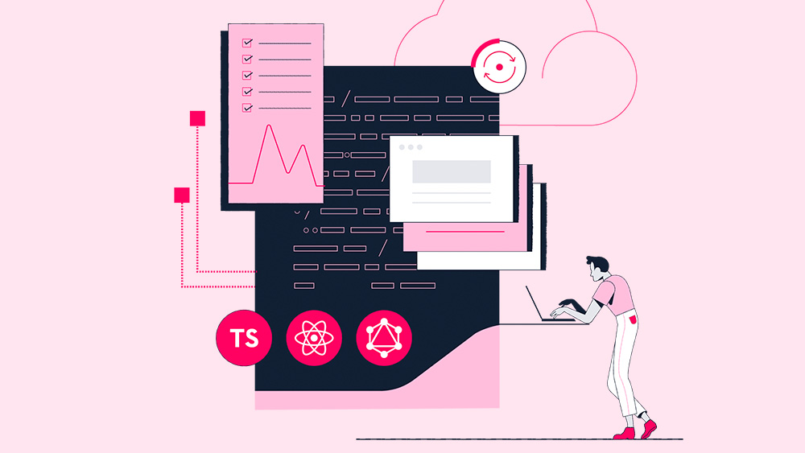

<h1 align="center">Hi 👋, I'm Anup Jaiswal</h1>
<h3 align="center">A passionate ML/AL enthusiam from India</h3>

  

  

  

- 🌱 I have completed **Bachelor of Engineering in COMPUTER SCIENCE**

- 📫 How to reach me **anupjaiswal1607@gmail.com**

- ⚡ Fun fact **I love to talk over chat**

## Connect with Me ⭐ :
<!--table>
  <tr>
    <th></th>
    <th></th>
    <th></th>
    <th> </th>
    
  </tr>
  <tr>
    <th>Twitter </th>
    <th>LinkedIn </th>
    <th>Facebook</th>
    <th>Youtube</th>
  </tr>
</table-->

&nbsp;
&nbsp;
&nbsp;

<!-- a href="https://www.codechef.com/users/janup9967" target="blank"></a-->

## Languages and Tools:

### Languages ⭐ :
<table>
  <tr>
    <th></th>
    <th></th>
    <th></th>
    <th></th>
    <th></th>
  </tr>
  </tr>
  <tr>
    <th>Python</th>
    <th>C Programming</th>
    <th>Java</th>
    <th>C#</th>
    <th>SQL</th>
  </tr>
</table>

### Frameworks ⭐ : 

          <!--a href="https://www.python.org" target="_blank" rel="noreferrer">  </a-->    <!--a href="https://www.cprogramming.com/" target="_blank" rel="noreferrer">  <--/a>  

<!--p>

&nbsp;</p-->
  
  ### Tools & IDE ⭐ :
<table>
  <tr>
    <th></th>
    <th></th>
    <th></th>
    <th></th>
    <th></th>
  </tr>
  <tr>
    <th>Jupyter</th>
    <th>VS Code</th>
    <th>Power BI</th>
    <th>Google Colab</th>
    <th>SQL Server</th>
  </tr>
</table>

